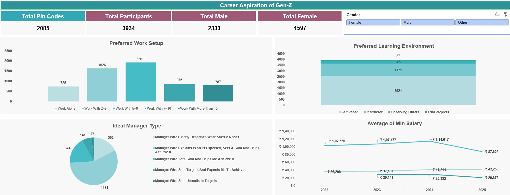
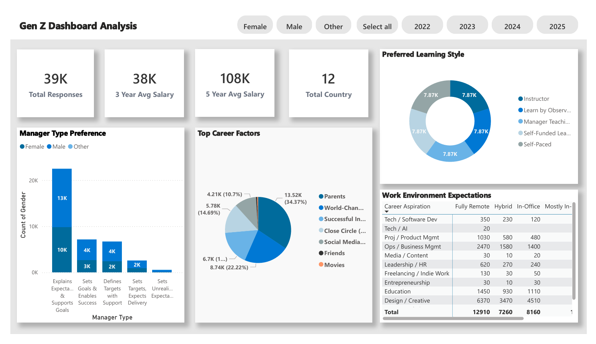
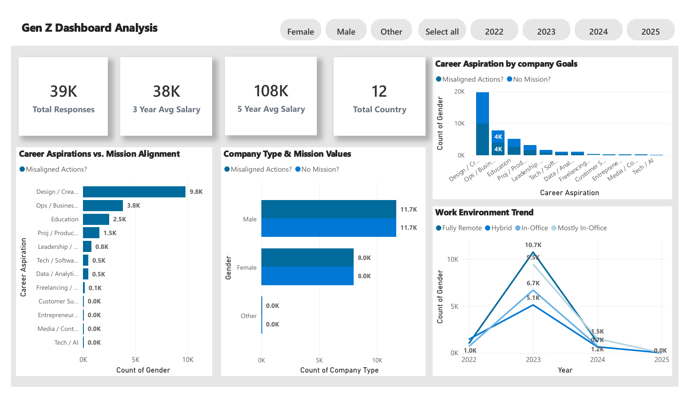

🎓 Understanding the Career Aspirations of Gen-Z – Excel Dashboard
This project explores the career preferences, learning styles, and expectations of Gen-Z individuals based on data collected through a structured survey.

🧩 Problem Statement:
To understand what Gen-Z expects from their careers, how they prefer to work and learn, and what kind of managerial support drives their motivation — all crucial for companies to build future-ready workplaces and education models.

📊 Key Outcomes from the Dashboard:
Work Setup Preference:
Most Gen-Z participants (1919) prefer working in small teams (5–6 members), indicating a strong inclination towards collaborative environments over solo or large-team work.

Learning Environment:
A vast majority (2521) favor self-paced learning, reflecting a demand for flexibility and autonomy in education or training programs.

Ideal Manager Type:
1181 participants chose managers who set goals and help achieve them, suggesting that Gen-Z values goal clarity and supportive leadership over traditional command-and-control styles.

Salary Expectations:
The average minimum expected salary increased steadily from 2022 to 2024 but showed a decline in 2025, especially among female participants. This may reflect market trends, economic shifts, or job awareness gaps.

🧠 Insights & Suggestions:
For Employers:

Focus on building team-oriented, mid-sized workgroups.

Promote mentorship-based management over micro-management.

Encourage flexible and self-directed learning programs as part of employee onboarding and upskilling.

For Educators and Trainers:

Design modular, self-paced courses.

Integrate project-based learning to simulate real-world trial projects.

For Policymakers & Recruiters:

Analyze and address the gender gap in salary expectations.

Create platforms to educate Gen-Z on realistic market salaries and career growth paths.

---------------------------------------------------------------------------------------------------------------------------------------------------------------------------

🚀 Gen Z Dashboard Analysis – Manager Aspirations
This Power BI dashboard visualizes insights into the managerial expectations, career drivers, and work environment preferences of Gen-Z individuals based on survey responses across 12 countries.

🎯 Objective:
To understand how Gen-Z expects to be managed, what career influences them the most, and what work and learning environments align with their aspirations — helping organizations and educators build Gen-Z inclusive strategies.

📊 Dashboard Highlights:
📥 Total Responses: 39,000+

🌐 Countries Represented: 12

💼 3-Year Avg Salary Expectation: ₹38K

💰 5-Year Avg Salary Expectation: ₹108K

🔍 Key Insights:
🧑‍💼 Manager Type Preference:
Top Choice:
“Explains Expectations & Supports Goals” is the most preferred manager type, especially among female participants (13K).

Secondary Preferences:

“Sets Goals & Enables Success”

“Defines Targets with Support”

Least Preferred:
Managers who set unrealistic expectations received very little support, showing Gen-Z's aversion to high-pressure environments without support.

💡 Top Career Factors:
Most Influential:

Parents (34%)

Social Media & Content (22%)

Close Circle / Friends (14%)

Gen-Z values guidance from family and peer networks, with digital media also shaping their ambitions.

🧠 Preferred Learning Style:
Evenly distributed across:

Instructor-led

Learn by observing

Self-paced

Manager-guided teaching

Self-funded learning
This shows that Gen-Z prefers a blended learning ecosystem.

🏢 Work Environment Expectations:
High preference for remote and hybrid roles in:

Tech / AI

Design / Creative

Ops / Business Management

Creative fields like design see over 6300 Gen-Z participants preferring fully remote roles.

In-office roles are still significant in education and leadership tracks.

📌 Recommendations:
For Organizations:
Develop supportive managers who clearly define expectations and actively help employees meet them.

Avoid unrealistic goal setting which negatively impacts engagement.

Embrace flexible work models, especially in tech, business, and creative roles.

For Educational Institutions:
Offer mixed-mode learning programs – instructor-led, self-paced, and practical experiences.

Involve parents and peer mentors in guidance programs, as they are key influencers for Gen-Z.

For Recruiters:
Align job roles with Gen-Z’s preference for remote and hybrid options.

Leverage platforms like social media to attract and engage top young talent.

------------------------------------------------------------------------------------------------------------------------------------------------------------------------

🌍 Gen Z Dashboard Analysis – Mission Alignment & Aspirations
This Power BI dashboard uncovers how well Gen Z career aspirations align with company missions and goals, along with trends in work environments and gender-based insights across countries.

🧩 Problem Statement:
There is often a disconnect between what Gen Z aspires to achieve and what companies offer or stand for. This analysis aims to uncover:

Whether Gen Z career goals align with mission-driven organizations.

Which job sectors show the highest misalignment.

How gender and work environment preferences vary over time.

📊 Dashboard Overview:
📥 Total Responses: 39K

📌 Countries Represented: 12

💰 Avg Salary (3-Year): ₹38K

💰 Avg Salary (5-Year): ₹108K

🔍 Key Insights:
⚠️ Career Aspirations vs. Mission Alignment:
A major misalignment is seen in the Design/Creative sector with 9.8K Gen Z individuals expressing aspirations not aligned with company missions.

Other sectors showing misalignment:

Operations/Business Mgmt – 3.8K

Education – 2.5K

Product/Project Mgmt – 1.5K

This misalignment highlights a gap between Gen Z’s purpose-driven outlook and the organizational goals of many sectors.

👨‍💼 Company Type & Mission Values:
Both Male and Female respondents report equal levels of exposure to companies lacking mission alignment (~11.7K for males, 8K for females).

Indicates that lack of mission clarity is widespread across industries, not gender-specific.

🎯 Career Aspiration by Company Goals:
Design/Creative tops again with over 20K respondents citing misaligned goals.

Fields like Tech, Entrepreneurship, and Media show minimal or no misalignment, indicating better goal alignment and clarity in these industries.

🧭 Work Environment Trend (2022–2025):
2023 saw a spike in Hybrid and Remote preferences (10.7K and 9.5K respectively).

A sharp decline follows in 2024 and zero data for 2025, possibly due to:

Shifts in workforce expectations

Reduced interest or delayed aspirations

Suggests a critical need to realign work models with Gen Z's long-term preferences.

💡 Recommendations:
For Organizations:
Clearly define and communicate your mission to attract purpose-driven talent.

Focus on industries like Design and Business Ops where goal alignment gaps are high.

Conduct internal audits on employee value alignment and communication.

For Educators & Mentors:
Prepare Gen Z for real-world challenges by bridging idealism with realism.

Provide career counseling on identifying companies with aligned values.

For Recruiters:
Promote roles with clear mission-driven narratives.

Highlight companies' social and environmental impact to attract Gen Z candidates.

